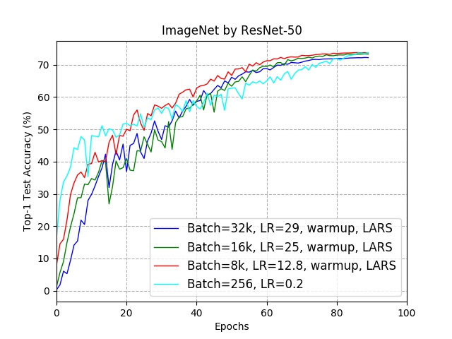

# torchlars

[](https://pypi.org/project/torchlars)
[](https://travis-ci.org/kakaobrain/torchlars)

A [LARS](https://arxiv.org/abs/1708.03888) implementation in PyTorch.

```python
from torchlars import LARS
optimizer = LARS(optim.SGD(model.parameters(), lr=0.1))
```

## What is LARS?

LARS (Layer-wise Adaptive Rate Scaling) is an optimization algorithm designed
for large-batch training published by You, Gitman, and Ginsburg, which
calculates the local learning rate per layer at each optimization step.
According to the paper, when training ResNet-50 on ImageNet ILSVRC (2016)
classification task with LARS, the learning curve and the best top-1 accuracy
stay similar to that of the baseline (training with batch size 256 without
LARS) even if the batch size is scaled up to 32K.

[Large Batch Training of Convolutional Networks](https://arxiv.org/abs/1708.03888)

Originally, LARS is formulated in terms of SGD optimizer and extension to other
optimizers was not mentioned in the paper. In contrast, `torchlars` implements
LARS as a wrapper which can take any optimizers including SGD as the base.

Additionally, LARS of torchlars is designed to more consider operation in the
CUDA environment compared to existing implementations. Thanks to this, you can
see only the little speed loss appears compared to just using SGD, in an
environment where CPU to GPU synchronization does not occur.

## Usage

Currently, torchlars requires the following environments:

- Python 3.6+
- PyTorch 1.1+

To use torchlars, install it via PyPI:

```bash
$ pip install torchlars
```

To use LARS, simply wrap your base optimizer with `torchlars.LARS`. LARS
inherits `torch.optim.Optimizer`, so you can simply use LARS as optimizer on
your code. After then, when you call step method of LARS, LARS automatically
calculates local learning rate before running base optimizer such as SGD or
Adam

The example code below shows how to use LARS using SGD as base optimizer.

```python
from torchlars import LARS

base_optimizer = optim.SGD(model.parameters(), lr=0.1)
optimizer = LARS(optimizer=base_optimizer, eps=1e-8, trust_coef=0.001)

output = model(input)
loss = loss_fn(output, target)
loss.backward()

optimizer.step()
```

## Benchmarking

### ResNet-50 on ImageNet classification

| Batch Size | LR policy    | lr   | warm-up | epoch | Best Top-1 accuracy, % |
| :--------- | :----------- | :--- | :------ | :---- | :--------------------- |
| 256        | poly(2)      | 0.2  | N/A     | 90    | 73.79                  |
| 8k         | LARS+poly(2) | 12.8 | 5       | 90    | 73.78                  |
| 16K        | LARS+poly(2) | 25.0 | 5       | 90    | 73.36                  |
| 32K        | LARS+poly(2) | 29.0 | 5       | 90    | 72.26                  |



Above image and table show the reproduced performance benchmark on ResNet-50,
as reported in Table 4 and Figure 5 of the paper.

The cyan line represents the baseline result, which is training result with
batch size 256, and others represent training result of 8K, 16K, 32K
respectively. As you see, every result shows a similar learning curve and best
top-1 accuracy.

Most experimental conditions are similar to used in the paper, but we slightly
change some conditions like learning rate to observe comparable results as
proposed by the LARS paper.

_Note: We refer [log file]
(https://people.eecs.berkeley.edu/~youyang/publications/batch/) provided by
paper to obtain above hyper-parameters._

## Authors and Licensing

torchlars project is developed by [Chunmyong Park] at [Kakao Brain], with
[Heungsub Lee], [Myungryong Jeong], [Woonhyuk Baek], and [Chiheon Kim]'s help.
It is distributed under [Apache License 2.0](LICENSE).

[chiheon kim]: https://github.com/chiheonk
[chunmyong park]: https://github.com/cmpark0126
[heungsub lee]: https://subl.ee/
[kakao brain]: https://kakaobrain.com/
[woonhyuk baek]: https://github.com/wbaek
[myungryong jeong]: https://github.com/mrJeong
